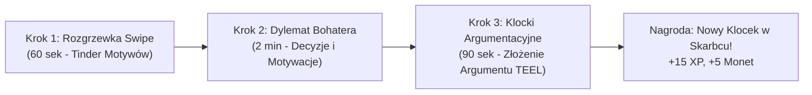
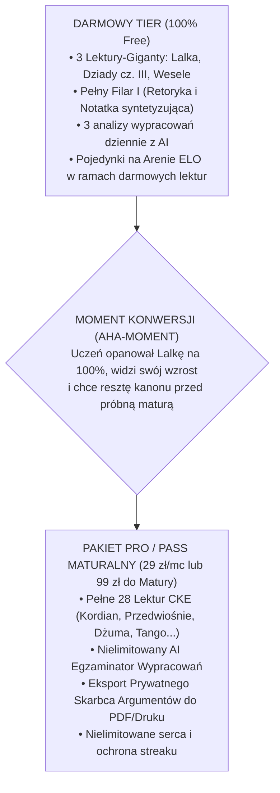

# 📜 Master Design & Product Spec: JASNE Polski
**„Lego Lekturowe & Szybki Tinder Motywów”**
*Koncepcja modułu języka polskiego dla platformy JASNE (Matura Formuła 2023 / 2026)*

---

## 🏛️ 1. Zgodność z Bazą Wiedzy JASNE i Wytycznymi Projektu

| Filar JASNE | Realizacja w Module Języka Polskiego |
| :--- | :--- |
| **BFF & Architektura** | Wszystkie zaawansowane analizy wypracowań i notatek syntetyzujących przechodzą przez Express Proxy (`/api/ai/polish-eval`). Zero kluczy API na frontendzie. |
| **Microlearning Core-4** | Lekcje zredukowane do 4–6 minutowych sprintów; Pigułka Bento dostosowana do humanistyki (`concept_essence`, `motywy_kluczowe`, `cytaty_kotwice`, `studium_postawy`, `cke_pułapka_kardynalna`). |
| **Design System (Nocturne Luminary)** | Tła bazy (`#070a0f`, `#0e1522`), akcenty szkarłatno-karminowe lektur (`#F43F5E`, `#E11D48`), pergaminowe złoto cytatów (`#FFDCA1`) i alabaster tekstu (`#F1F5F9`). |
| **Inżynieria Behawioralna & Hooked** | Pętla natychmiastowej gratyfikacji (dźwięki, XP, monety po każdym swipe/zadaniu); ochrona streaku (`streakFreezes`); mechanika rdzewienia lektur wg krzywej Ebbinghausa (**Campus Rust**). |
| **Wirtualna Ekonomia** | Zachowanie stawek: regeneracja serc co 30 min (`REGEN_INTERVAL_MS`), pełne odnowienie za 150 monet (`HEARTS_REFILL_COIN_COST`), darmowe analizy AI (3/dzień w wersji free). |
| **Struktura Egzaminacyjna CKE (60 pkt)** | Odzwierciedlenie oficjalnego podziału arkusza: **Filar I** (Język w użyciu – 10 pkt), **Filar II** (Test historycznoliteracki – 15 pkt), **Filar III** (Wypracowanie – 35 pkt). |

---

## 🎯 2. Core Hook: Dlaczego to pokochają maturzyści?

### Główny ból maturzysty
Język polski na maturze kojarzy się z:
1. Nudnymi, stustronicowymi streszczeniami, których nikt nie pamięta tydzień po przeczytaniu.
2. Paniką przed **błędem kardynalnym** (wyzerowanie wypracowania 35 pkt za przekręcenie losów kluczowego bohatera).
3. Paraliżem przed pustą kartką w wypracowaniu na smartfonie.
4. Sztywnym, archaicznym i pretensjonalnym językiem szkolnych repetytoriów.

### Nasza odpowiedź: „Lego Lekturowe & Tinder Motywów”
Zamiast biernego czytania streszczeń – **aktywna, dynamiczna gra decyzyjna**:
- **Swipe'ujesz fakty i motywy** w 60-sekundowych seriach.
- **Wcielasz się w bohaterów** w dylematach psychologicznych, rozumiejąc ich motywacje zamiast wkuwać daty.
- **Zbierasz klocki argumentacyjne** do swojego prywatnego **„Skarbca Argumentów”**, który staje się gotową „legalną bronią” na majowy egzamin.
- Piszesz na telefonie mikro-zdania (tezy, wnioski, parafrazy), a resztę składasz jak klocki Lego.

---

## 📱 3. Architektura Interfejsu (Hub 3 Filarów CKE)

Ekran główny przedmiotu `jezyk-polski` odchodzi od monotonnej listy rozdziałów na rzecz **Centrum Dowodzenia 3 Filarów**:

```
+-------------------------------------------------------------------+
|  [<-]  JĘZYK POLSKI (Formuła 2023/2026)      ❤️ x5  🪙 420  🔥 14 |
+-------------------------------------------------------------------+
|  📊 Przewidywany Wynik CKE: 78% (47/60 pkt)        [Szczegóły]    |
|  ⚠️ 2 lektury wymagają naoliwienia (Campus Rust: Dziady, Lalka)   |
+-------------------------------------------------------------------+
|                                                                   |
|  [ FILAR I: Język w użyciu ] (10 pkt)                             |
|  • Arcade Erystyczny (manipulacje, funkcje języka)                |
|  • Kondensator Notatki Syntetyzującej (60-90 słów)                |
|                                                                   |
|  [ FILAR II: Kanon Lektur & Epoki ] (15 pkt)                      |
|  • Oś Czasu Epok (Antyk -> Współczesność)                         |
|  • Karty Lektur (Stan wiedzy, wskaźnik kardynała, Tinder motywów) |
|                                                                   |
|  [ FILAR III: Warsztat Wypracowania ] (35 pkt)                    |
|  • Lego-Rozprawka (Warsztat tezy, argument TEEL, konteksty)       |
|  • Polowanie na Kardynała (Tryb Rewizora CKE)                     |
|                                                                   |
+-------------------------------------------------------------------+
|  💼 PŁYWAJĄCY WIDŻET: [ 🎒 Mój Skarbiec Argumentów (38 klocków) ]|
|  ⚔️ PRZYCISK AKCJI:   [ ⚡ Szybki Blitz 1v1 na Arenie ]           |
+-------------------------------------------------------------------+
```

---

## 🔄 4. 3-Krokowa Pętla Mikro-Lekcji (Micro-Loop)

Każda lekcja poświęcona lekturze trwa **4–5 minut** i składa się z żelaznej sekwencji:



### Krok 1: Rozgrzewka Swipe (`SwipeCard`)
- 5–8 szybkich kart przesuwanych w lewo/prawo.
- Przykłady gestów:
  - **Fakt czy Kardynał?** (np. *„Wokulski zginął wysadzając zamek w Zasławiu”* ➔ Swipe w LEWO: BŁĄD KARDYNALNY! Nigdy tego nie potwierdzono!).
  - **Dopasuj Bohatera** (np. *„Poświęca miłość dla idei naprawy świata”* ➔ Tomasz Judym vs Stanisław Wokulski).
  - **Przynależność Motywu** (np. *„Czy motyw Arkadii występuje w Panu Tadeuszu?”* ➔ Swipe w PRAWO: TAK, Soplicowo).

### Krok 2: Dylemat Bohatera / Studium Przypadku
- Gracz analizuje kluczową scenę lektury w interaktywnym dylemacie:
  - *Sytuacja*: Wokulski jedzie pociągiem do Paryża z Izabelą i Starskim. Izabela mówi po angielsku, myśląc, że Stanisław nie rozumie.
  - *Pytanie decyzyjne*: Co w tej scenie stanowi punkt zwrotny w psychice Wokulskiego i jak zinterpretujesz to na maturze?
  - *Wybór*: Analiza postawy (upadek mitu kobiety-anioła, zderzenie romantycznego idealizmu z cynizmem arystokracji).

### Krok 3: Klocki Argumentacyjne (`ArgumentBuilder`)
- Uczeń buduje argument pod realny temat maturalny CKE, układając klocki:
  1. **Klocek 1 (Teza cząstkowa)**: Idealizm potrafi być źródłem wielkiej siły, ale w zderzeniu z fałszywym obiektem uczuć prowadzi do samozagłady.
  2. **Klocek 2 (Egzemplifikacja z lektury)**: Stanisław Wokulski podporządkowuje cały majątek i pracę zdobyciu Izabeli Łęckiej.
  3. **Klocek 3 (Kontekst pogłębiający)**: Kontekst biograficzny Prusa i filozofia pozytywizmu (praca u podstaw zderzona z romantycznym dekadentyzmem).
  4. **Klocek 4 (Puenta/Wniosek)**: Ostateczny krach bohatera dowodzi anachronizmu romantycznej koncepcji miłości w realiach kapitalistycznych.
- **Wynik**: Gracz klika „Zapisz do Skarbca”. Klocek trafia do jego bazy wiedzy na egzamin.

---

## 🧩 5. Trzy Nowe Komponenty Interaktywne

### 1. `SwipeCard` (Tinder Motywów & Faktu)
- **UI/UX**: Karta centralna z subtelnym trójwymiarowym cieniem, obsługa gestów dotykowych (swipe left / swipe right) oraz przycisków pomocniczych na dole:
  - ❌ Czerwony krzyżyk (Fałsz / Błąd Kardynalny / Lektura A)
  - 💚 Zielony ptaszek (Prawda / Czysty Fakt / Lektura B)
- **Haptic Feedback**: Lekka wibracja przy przesunięciu, soczysty dźwięk przy trafieniu, alarmujący brzęczyk przy wpadnięciu na kardynała.
- **Licznik tempa**: Czas reakcji nagradzany mnożnikiem Combo (x1.2, x1.5 XP).

### 2. `ArgumentBuilder` (Kreator Klocków Lego)
- **UI/UX**: Tablica z czterema pustymi slotami na argument w formule **TEEL**:
  - `[T]` Topic Sentence (Teza cząstkowa)
  - `[E]` Explanation / Evidence (Sytuacja z lektury)
  - `[C]` Context (Kontekst: filozoficzny, historyczny, literacki)
  - `[L]` Link to Thesis (Powiązanie z tematem nadrzędnym)
- Uczeń wybiera właściwe kafelki z puli i układa spójną logicznie całość. Błędne dopasowanie kontekstu generuje natychmiastowe wyjaśnienie pułapki (np. *„Uwaga: Pozytywizm nie popierał samotnego mesjanizmu – to kategoria romantyczna!”*).

### 3. `CardinalDetector` (Polowanie na Kardynała / Rewizor CKE)
- **UI/UX**: Ekran stylizowany na arkusz maturalny sprawdzany przez Egzaminatora CKE z czerwonym długopisem.
- Uczeń widzi 3 fragmenty uczniowskich prac. Jeden z nich zawiera ukryty **Błąd Kardynalny**:
  - Przykłady pułapek: *„Jacek Soplica zginął na schodach zamku z ręki Gerwazego”* (FAŁSZ: Gerwazy mu przebaczył, Soplica zmarł od odniesionych ran po bitwie).
  - *Zadanie*: Zaznacz palcem fałszywy fragment i wskaż poprawną wersję z kanonu CKE.
  - Buduje żelazną czujność faktograficzną.

---

## 📝 6. Filar I: Warsztat Arkusza 1 (Język w Użyciu)

### A. Arcade Erystyczny
- Błyskawiczne rozpoznawanie manipulacji językowej i funkcji wypowiedzi:
  - *Format*: Wyświetla się krótki nagłówek, post z TikToka lub fragment przemówienia z arkusza CKE.
  - *Wybór pod presją czasu (8 sekund)*: Jaka to funkcja języka? (Informatywna, Impresywna, Ekspresywna, Fatyczna, Metajęzykowa, Poetycka).
  - *Erystyka*: Wskaż chwyt erystyczny (Ad personam, Równia pochyła, Argumentum ad baculum, Fałszywa dychotomia).

### B. Kondensator Notatki Syntetyzującej (60–90 słów)
Zadanie za 4 punkty, na którym maturzyści masowo tracą punkty za kompozycję i objętość:
1. **Etap 1 (Sito faktów)**: Podświetlenie 2 wspólnych myśli z tekstu A i tekstu B; odrzucenie zdań pobocznych.
2. **Etap 2 (Parafraza anty-plagiat)**: Zamiana dosłownych sformułowań autorów na własny język uogólniający (eliminacja cytatów).
3. **Etap 3 (AI Strażnik Obiektywizmu i Licznik Słów)**:
   - Dynamiczny pasek: zielony w przedziale **60–90 słów** (żółty poniżej 60, czerwony powyżej 90).
   - **Filtr Anty-Opiniowy**: AI natychmiast wykrywa i podświetla na czerwono zwroty: *„Moim zdaniem”*, *„Uważam, że autor ma rację”*, *„Według mnie”* – które w notatce CKE skutkują utratą punktów.

---

## ⚔️ 7. Arena ELO: „Lekturowy Blitz 1v1”

Pojedynki PvP w języku polskim trwają dokładnie **60 sekund** i składają się z 5 błyskawicznych rund:

| Runda | Nazwa Rundy | Mechanika (10 sekund na decyzję) |
| :---: | :--- | :--- |
| **R1** | **Błyskawiczny Bohater** | Kto pierwszy przypisze nietypową postać do lektury (np. *Julian Ochocki* ➔ *Lalka*). |
| **R2** | **Czysty Fakt czy Kardynał?** | Swipe: czy twierdzenie o losach bohatera jest zgodne z kanonem CKE? |
| **R3** | **Detektor Chwytu** | Rozpoznaj funkcję tekstu lub środek stylistyczny w podanym zdaniu. |
| **R4** | **Wyklucz Intruza (Motyw)** | Który z 4 utworów NIE realizuje danego motywu (np. *Motyw zdrady narodowej*)? |
| **R5** | **Czyj to Głos? (Złoty Cytat)** | Fragment monologu – kto to powiedział i do kogo? |

**Stawka**: Punkty ELO, wirtualne monety (`+25 🪙`), awans w Szkolnej Lidze Maturalnej.

---

## 🎭 8. Kameleoniczny Tone of Voice

Aplikacja balansuje między dwoma biegunami komunikacyjnymi:

### 1. Na co dzień: Błyskotliwy, Młodzieżowy Partner (Gen-Z)
- *O Wokulskim*: „Stanisław znowu ignoruje wszystkie red flagi u Łęckiej. Kupuje kamienicę, uczy się angielskiego, a Izabela w pociągu flirtuje ze Starskim. Klasyczny case romantycznego idealisty zderzonego z chłodnym kalkulatorem.”
- *O Kordianie na Mont Blanc*: „Kordian wchodzi na szczyt Europy, rzuca monolog życia, krzyczy *Polska Winkelriedem narodów!*, po czym mdleje i zabiera go chmura. Brzmi chaotycznie, ale CKE uwielbia to jako symbol polskiego czynu zbrojnego.”

### 2. W feedbacku wypracowań i kardynałów: Chirurgiczny Egzaminator CKE
- *Ostrzeżenie o kardynale*: „⚠️ **BŁĄD KARDYNALNY (0 PKT ZA CAŁE WYPRACOWANIE)**: Napisałeś, że Rolison zginął, wypadając z okna celi. W III części Dziadów pani Rolisonowa mówi Senatorowi, że jej syn został zmasakrowany i wyrzucony przez okno, lecz *żyje* i jęczy. Taki błąd w maju unieważnia Twoją pracę. Zapamiętaj ten detal!”

---

## 💰 9. Model Biznesowy i Freemium (Kanon 3 Lektur)

Zgodnie z decyzją projektową wprowadzamy jasny i pociągający lejek konwersji:



---

## 🎬 10. Scenariusz Pokazowy (Showcase Walkthrough)

### Studium Przypadku A: *LALKA* Bolesława Prusa

#### 1. Rozgrzewka Swipe (`SwipeCard`):
1. *„Wokulski dorobił się majątku na handlu bronią i dostawach dla wojska podczas wojny rosyjsko-tureckiej.”* ➔ **SWIPE W PRAWO (PRAWDA)**.
2. *„Izabela Łęcka doceniała poświęcenie Stanisława i zerwała kontakt ze Starskim.”* ➔ **SWIPE W LEWO (FAŁSZ/KARDYNAŁ)**.
3. *„Rzecki w swoim Pamiętniku reprezentuje wiarę w bonapartyzm.”* ➔ **SWIPE W PRAWO (PRAWDA)**.

#### 2. Dylemat Bohatera:
- *Scena*: Zasław – spacer Wokulskiego z Izabelą. Wokulski wierzy, że Izabela go kocha, bo rozmawia z nim życzliwie.
- *Wybór egzaminacyjny*: Jak zinterpretować ruinę zamku w Zasławiu jako motyw vanitas i symbol relacji bohaterów?

#### 3. Złożenie Klocka do Skarbca:
- **Motyw**: *Niezrozumienie jednostki wybitnej przez społeczeństwo*.
- **Klocek**: Wokulski jako człowiek pogranicza epok: dla arystokracji jest „kupcem i parweniuszem”, dla pozytywistów warszawskich – szalonym marzycielem marnującym kapitał na arystokratkę.
- **Kontekst**: Filozofia pozytywizmu (Herbert Spencer – organicyzm) vs polski anachronizm feudalny.

---

### Studium Przypadku B: *DZIADY CZĘŚĆ III* Adama Mickiewicza

#### 1. Polowanie na Kardynała (`CardinalDetector`):
Znajdź fałszywe zdanie w akapicie:
> *(A) Konrad w Małej Improwizacji czuje się jak orzeł, lecz jego lot blokuje czarny kruk – symbol pychy.*
> *(B) W Wielkiej Improwizacji Konrad domaga się od Boga rządu dusz i grozi, że nazwie Go carem.*
> *(C) Konrad osobiście wykrzykuje ostateczne bluźnierstwo, po czym zostaje potępiony i porwany przez diabły na zawsze.*

👉 **Uczeń wskazuje zdanie (C)**:
*Komentarz CKE*: „Doskonale! Konrad MDLEJE przed wypowiedzeniem słowa *carem*. Ostatnie bluźnierstwo dopowiada z boku Głos Szatana! Za Konrada wstawia się ksiądz Piotr, a bohater uzyskuje szansę odkupienia win.”

---

## 🛠️ 11. Architektura Danych (Rozszerzenie Schematu)

W `src/types.ts` oraz strukturze Firestore dodajemy dedykowane typy dla zadań humanistycznych:

```typescript
export type PolishTaskType = 
  | 'SWIPE_MATCH'          // Tinder motywów i faktów (lewo/prawo)
  | 'ARGUMENT_BUILDER'     // Klocki TEEL do wypracowania
  | 'CARDINAL_DETECTOR'    // Polowanie na błąd kardynalny
  | 'SYNTHESIS_CONDENSER'  // Sito notatki syntetyzującej
  | 'RHETORIC_ARCADE';     // Szybkie rozpoznawanie chwytów

export interface PolishArgumentBlock {
  id: string;
  book_id: string;
  book_title: string;
  character: string;
  theme: string;           // np. "Władza", "Miłość niszcząca", "Bunt"
  claim: string;           // Teza cząstkowa
  evidence: string;        // Sytuacja fabularna
  context_type: 'BIOGRAPHICAL' | 'HISTORICAL' | 'PHILOSOPHICAL' | 'LITERARY';
  context_description: string;
  punchline: string;
  cke_safety_rating: '100%_SAFE' | 'TRICKY';
}

export interface UserArgumentVault {
  userId: string;
  unlockedBlocks: PolishArgumentBlock[];
  savedCustomBlocks: PolishArgumentBlock[];
  coveragePercent: number; // np. 82% pokrycia motywów maturalnych CKE
}
```

---

## 🚀 12. Podsumowanie Wdrożeniowe

Koncepcja **„Lego Lekturowe & Tinder Motywów”** przekształca najtrudniejszy, najbardziej znienawidzony przedmiot maturalny w:
1. **Dynamiczną, wizualną mobilną grę** (swipe, drag & drop, krótkie dylematy).
2. **Skuteczną tarczę anty-kardynalną** (zero stresu przed majową katastrofą).
3. **Konkretny, wymierny zysk** („Skarbiec Argumentów”, który uczeń może wydrukować przed maturą).
4. **Naturalną maszynę konwersji** (3 darmowe lektury tworzą natychmiastowy nawyk, a pozostałe 25 lektur gwarantuje opłacenie Passa Maturalnego).
